# Custom Model Guide

Incomplete. Uploading to let someone else pick up from me.
- Sewer

!!! info

    This guide is relatively recent and could probably be improved.  
    If you have used it and are familiar with the model editing workflow, please consider helping us.  

!!! info

    This guide will soon be available in video form.   

!!! note

    The tooling at the moment in time only targets Windows. If you have a demand for alternate OS support, please let us know. [Model exporter](https://github.com/Argx2121/Sega_NN_tools) requires triangle stripping dependency with no native Python implementation. [Public contributions would be welcome!!]

## Prerequisites 

You will need to download the following items first.  

| Program                                                                                                                                                                                   | Purpose                                                          |
|-------------------------------------------------------------------------------------------------------------------------------------------------------------------------------------------|------------------------------------------------------------------|
| [.NET 5 Runtime](https://dotnet.microsoft.com/download/dotnet/5.0) [(Windows)](https://dotnet.microsoft.com/en-us/download/dotnet/thank-you/runtime-desktop-5.0.17-windows-x64-installer) | Required to run Sewer's Sonic Riders tools.                      |
| [Blender](https://www.blender.org/download/)                                                                                                                                              | Modelling software.                                              |
| [Sega NN Tools](https://github.com/Argx2121/Sega_NN_tools/archive/refs/heads/master.zip)                                                                                                  | Blender Plugin for Riders' Model Formats (and 20+ other games!). |
| [RidersArchiveTool](https://github.com/Sewer56/SonicRiders.Index/releases/tag/1.3.0)                                                                                                      | Sewer's tool for extracting compressed Riders archives.          |

It's recommended to download Blender from Steam; in order to receive automatic updates.

## Finding Game Files

### PC Riders


In the PC Version of Sonic Riders, there exists a folder called `Data`. This folder will have all of the files necessary to perform model edits.  

### GameCube Riders

!!! info 

    For the GameCube port of the game, you will first need to extract the ROM. The guidance below shows how to do that with Dolphin Emulator.

To do so, right click the game on your game list, and select `Properties`.  


Then scroll right to the `FileSystem` section, right click `Disc` and select `Extract Entire Disc`.

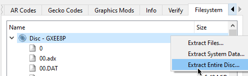

Go to the folder where you have extracted the ROM, and into the `files` folder.  
You will be getting the original models from this folder.  

(If this folder has >1000 files and/or contains a `_Main.rel` file then you probably found the right one.)

## Finding Models

!!! info 

    This section describes where to find your desired game models to edit.

This wiki contains a very useful page known as the [File Listing](../files/list.md). This page contains a list of all files in Vanilla PC Riders including what they are, and what they contain.  

In the case of player models, they use the format P{X}{YY}, where:  
- `P` represents 'Player'.  
- `{X}` is a single letter that is a shorthand for character.  `e.g. 'S' is Sonic, 'T' is Tails`  
- `{YY}` number that represents the gear. e.g. `00` is Default Gear.  


!!! tip 

    It is recommended you pick a model with similar proportions to the model you're replacing.  
    For example, if you're adding a human-like character; consider replacing Ulala.  

## Extracting Models

!!! info 

    This section describes how to extract the Riders Archives e.g. `PA00` to obtain the models.

### Extracting Archives

!!! info "If you already know Commandline."

    `RidersArchiveTool.exe extract --source <pathToArchive> --savepath <whereToOutput>`.  
    Include `--bigendian` if working for GCN.  

For this you will use `RidersArchiveTool.exe` that you have downloaded previously from the prerequisites.  
This is a commandline tool, so you will need to use the `Command Prompt`.  

- Open a `Command Prompt` window (Press `Super (Windows)` key, search `cmd` and press `Enter`).  
- Drag `RidersArchiveTool.exe` over the `cmd` window.  
- Press `space` and type in `extract` to make `<some_folder_path>/RidersArchiveTool.exe extract`, and press `enter`.  


This will show you the available options for extraction. In this case, we will want to specify `--source` and `--savepath`; to create a command such as `RidersArchiveTool.exe extract --source "D:\Games\ISOs\Sonic Riders Vanilla\files\PA00" --savepath "C:\Users\sewer\Downloads\Build\output" --bigendian`.  


### Finding the Model

!!! info 

    Demonstrates where the model is inside the extracted archive.

Inside the extracted folder you will find folders under the name `XXX_YYYYY`. `XXX` represents the original order of the file in the archive and `YYYYY` represents the type of the contents of that group of files. The known `YYYYY`s are documented over at [File Formats](../files/formats.md#internal-file-formats-all-ids).  

In any case, for Player models, this is `00000`. 


Model formats use the `.*NO` extension. For GameCube, this is `.GNO`; for PC this is `.XNO`.  
You can now import this model into Blender.  

!!! info 

    The Vanilla game combines the player model and gear e.g. `PA00` would contain Amy and her Default Gear.  
    Modern mods of Sonic Riders separate these models; so there's usually only 1 model for each character and 1 model (in a separate file) for each gear. Guidance for that will be available in the future.  

## Working with Blender

### Installing the Plugin

!!! info 

    Demonstrates how to install and run the plugin in Blender.

!!! warning

    You must download the latest version of the plugin from source code by clicking `Code` and then `Download Zip` on the page for [NN Tools](https://github.com/Argx2121/Sega_NN_tools). The current `GitHub Release` does not yet contain the exporter.  

    (If you used the guide in the link, nothing to worry about.)

To install the importer & exporter plugin, go to `Edit`->`Preferences`, and navigate to the `Add-ons` menu.  
Click `Install` and select the zip file for the plugin (This will probably be called `Sega_NN_tools-master.zip`).  

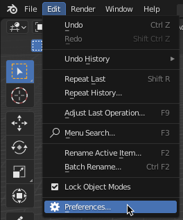

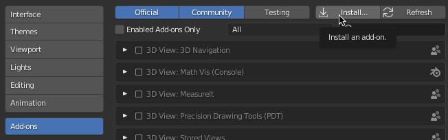

Click `Install` and select the zip file for the plugin (This will probably be called `Sega_NN_tools-master.zip`).  

Once you have installed the plugin, search for `NN`, and enable the `Sega NN Tools` plugin using the checkbox.


### Importing Models

!!! info 

    Demonstrates how to import an existing model into Blender.  

Open the `NN Tools` sidebar menu by dragging the little arrow where mouse is on the screenshot, left.  

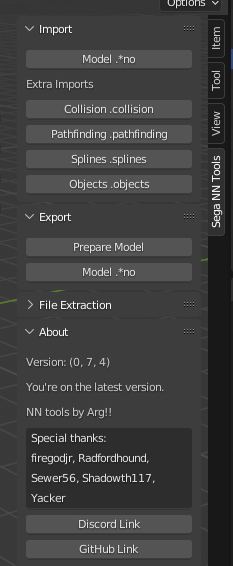

Press `Model *.no` and select the format (`.GNO for GameCube` or `.XNO for PC`), and `Sonic Riders` from the games list, navigate to your extracted model from earlier and press `Import`.  

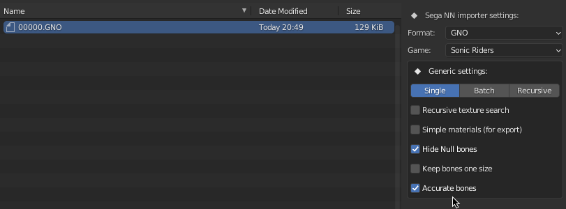

### Renaming Bones

!!! info 

    Renaming bones using a blender script.

Imported Riders models will have autogenerated bone names, which are inconvenient to work with when rigging models.  

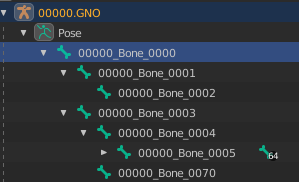

To fix this (at least for non-bike characters), a blender script is provided below.  

```py
# TODO: Add script here. [Sewer is lazy to transcribe from screenshot, doesn't have it on hand]
```

Select the armature/rig inside the Blender Scene Explorer and navigate to the `Scripting` tab. Paste the script and press the `Run` button.  

### Rigging the Model

!!! todo

    Replace the screenshots from this part of the tutorial onwards.

!!! info 

    Applying the armature of the old model to the new model; to make it compatible with existing animations.  

Delete the meshes of the old model, and the armature of the new model you are replacing it with.

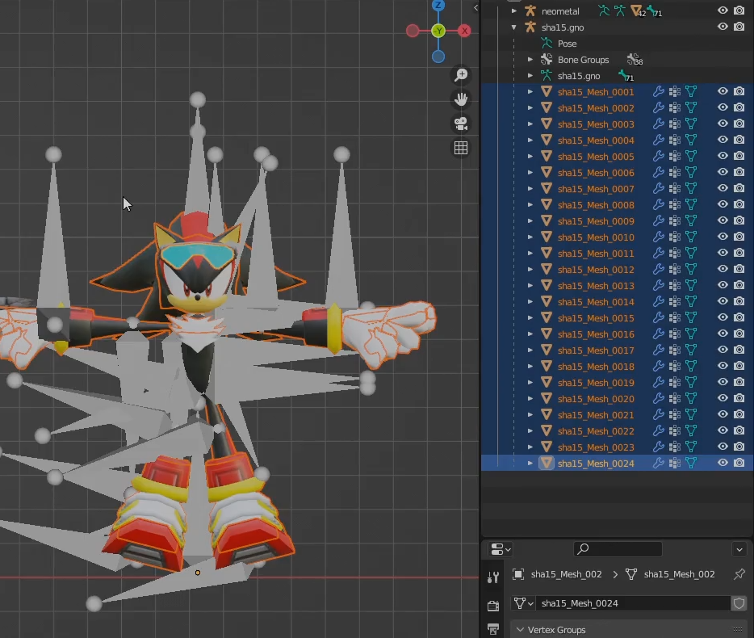

(Pictured: Deleting old meshes.)

Align the model armature over the new model. An easy way to do this is to center the position of both models to 0,0,0 in the `Transform` window.  

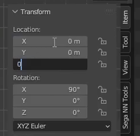

(Select old model in scene explorer, set transform to 0,0,0; repeat for new model)

#### Getting A Nicer View

!!! tip 

    Work with Wireframe mode (`Hotkey: Z`) to be able to see the bones and the model at the same time.  

It's highly recommended that you change the bones to display as a `stick` in the Viewport Display. Working with the defaults can be pretty messy.  

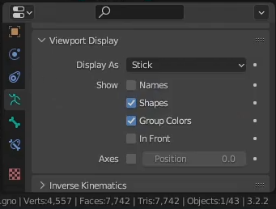

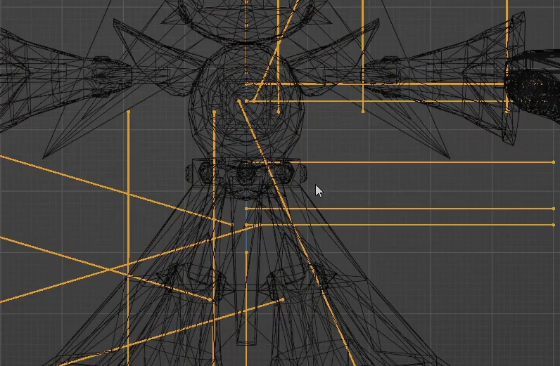

(this is cleaner than the alternative...)

#### Adjusting Bone Positions

!!! tip 

    Before adjusting the bones manually, consider scaling the bones to get a better fit with the new model.  

Once the old bones and new model are overlaid, it is recommended to manually move the bones to better match the model.  
e.g. you will want to nudge bones such that for example, a knee bone would match the middle of the knee rather than being off center.  

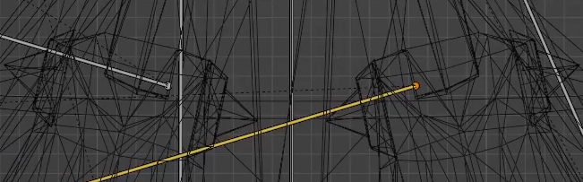

[Bad Positioning, Does not Match Knee Center]


[Better Positioning]

!!! warning 

    Be careful when moving bones. You should not move the bones' head or tail individually. Only move the bone as a whole. Moving head/tail individually will result in messed up animations due to a change in rotation.

#### Assigning Weights

!!! info 

    This part involves assinging 'weights' of vertices to individual bones in the armature.  
    'Weights' influence how movements of the bone affect movements of the individual vertices and is how animations work.  

First hide the armature, by selecting it and pressing the little `eye` icon (alternatively `Hotkey: H`).


Select everything with `A` on keyboard, unhide the armature (ctrl+click it in scene viewer, and `Alt+H`) and click one of the bones while holding `Shift`.  
Then press `Ctrl+P` to parent. Select `Armature Deform: With Empty Groups`.  

We have now assigned the 

!!! tip 

    Automatic weights are not recommended, will likely weight to wrong bones due to sheer bone count.

!!! tip 

    You are now ready to weight.  
    Consider learning how to do this through external tutorials on YouTube and co.  
    Key phrase to search is 'weight painting guides'.  

#### Assigning Weights

## Packing Models

!!! info 

    Demonstrates how to put the model back into the game after exporting.

Rename your exported `.gno` / `.xno` to the name of the original file that you extracted (e.g. `00000.gno`); then replace the file. 

In order to pack the archive, you would again use `RidersArchiveTool`, but this time with the `pack` command, like so:  

`RidersArchiveTool.exe pack --source C:\Users\sewer\Downloads\Build\output --savepath C:\Users\sewer\Downloads\Build\PA00`

If you are targeting GameCube, you should specify `--bigendian` and it is recommended to use the `--compress` flag. If you are targeting PC, it's recommended to specify neither flag. 


Once you have packed the archive, replace the original one in the game folder and give it a go.  

!!! tip

    If you are working with the PC version, you should create a [Reloaded-II Mod](https://reloaded-project.github.io/Reloaded-II/CreatingMods/). This will make it easier for people to use and will prevent you from overwriting your original game files.  

## Credits

Arg!! & Sewer56 for the original creation of this guide.  

